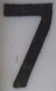

# The mission
Read the volume of water consumed by analyzing a 
photo of a water meter.

# The setup
I happened to have a Raspberry Pi 3 lying around as 
well as a Pi camera and [Blinkt](https://shop.pimoroni.com/products/blinkt)
LED list.

# Capturing an image
To turn the Blinkt on and capture a photo with the Pi camera
I have written a small Python script that functions as a web server.
The script and information about how to install it 
on the Raspberry Pi can be found here: 
[Python PiCamera Webserver](/jakeru/picamera).
Any WiFi camera equipped with a LED can be used of
the setup I have chosen. 

# Analyzing the image
I use OpenCV and Python to analyze the captured image 
of the water meter.
This script happens to run on another computer in
my setup, but it is very possible to run it on the
same Raspberry Pi that takes the photo if that
setup is chosen.
 
This Git repository contains the scripts I use to
analyze the photo of my water meter.

## The digits

The script [digits.py](watermeter/digits.py) extracts
and classifies the digits. For my water meter the digits 
give the amount of water consumed in cubic meters.

### Extract the digits

The first step is to extract all the digits and to do that the
function 
[getPerspectiveTransform()](https://docs.opencv.org/2.4/modules/imgproc/doc/geometric_transformations.html#getperspectivetransform)
is used to get an image that looks something like this:

The outer corners of the digits was found out manually by 
using Gimp. 

The script then extracts one digit at a time. 
The size and position of the digits was found out
manually, again by using Gimp, but this time by looking at
the transformed image.

### Classify the digits
 
In order to be able to classify the digits we need
need templates. I collected each digit and saved them as
separate images. They are located in the directory 
[digits](digits/) and this is how a few of them look like:

The function 
[matchTemplate](https://docs.opencv.org/2.4/modules/imgproc/doc/object_detection.html#matchtemplate)
is used to do the actual classification.
The template that gives the best match is used.

## The Gauges

My water meter happens to have 4 gauges as well. This gives
an accuracy at deciliter level.

The script [gauges.py](watermeter/gauges.py) extracts each
gauge and the values they represent.

Again, a perspective transformation is used, but this time
the script does one transformation for each gauge.
